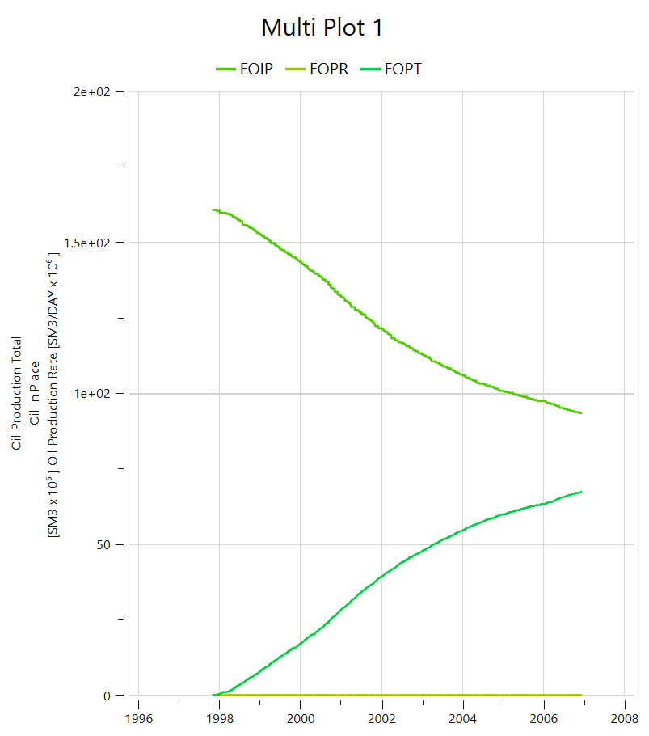
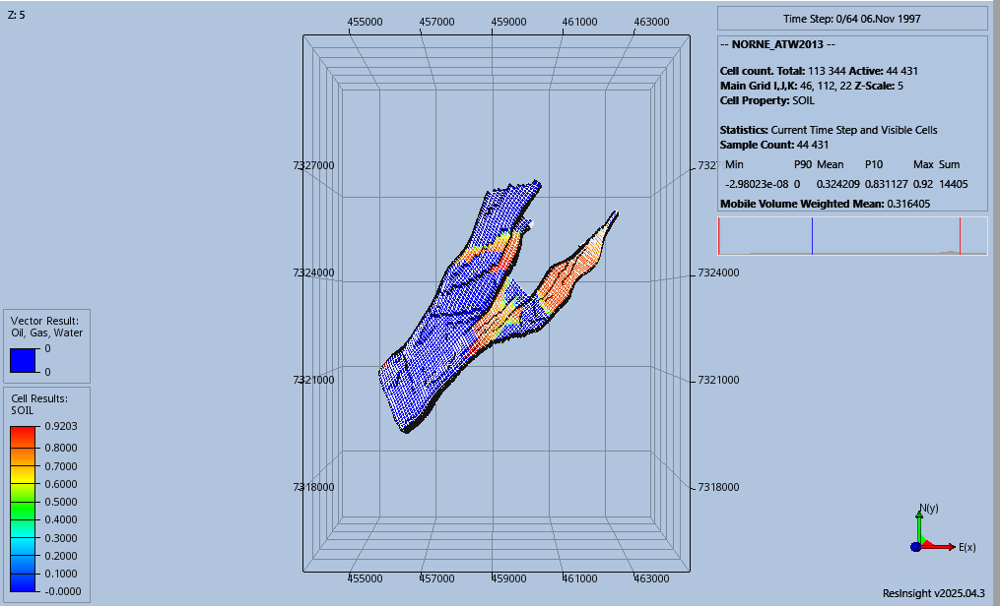
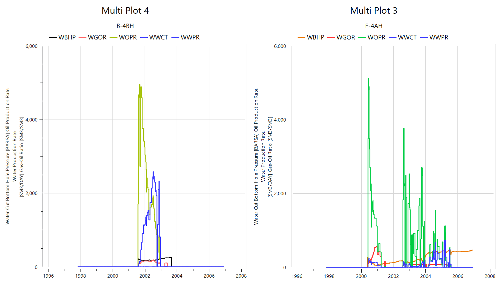
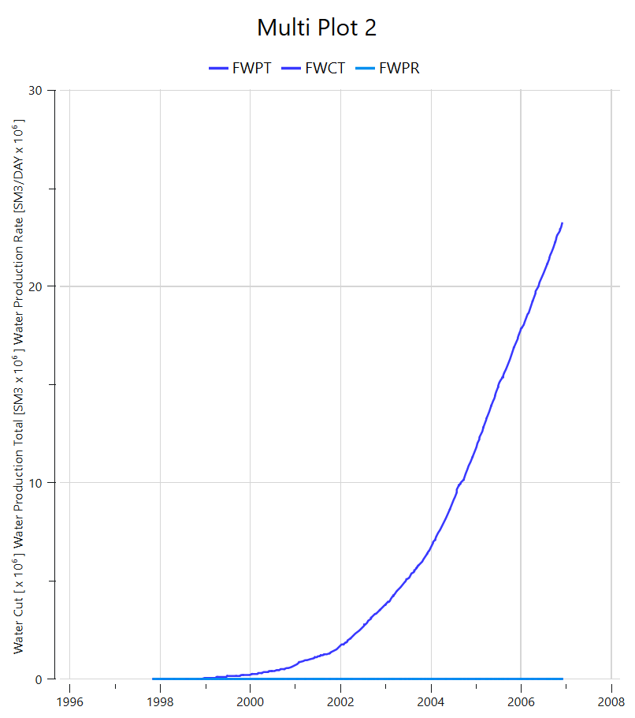
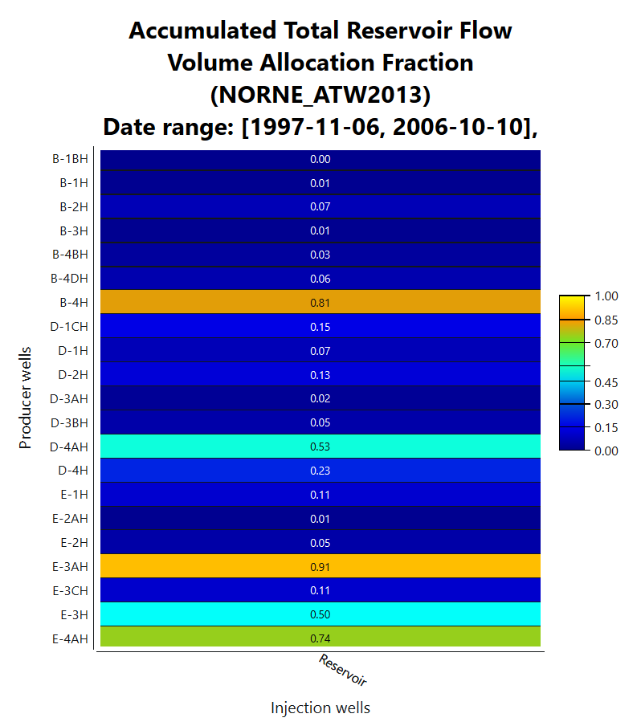

# NORNE Reservoir Simulation – Field and Well Performance Review

This portfolio project documents selected outputs from a **deterministic black-oil forward simulation of the open NORNE benchmark case** using **OPM Flow** and **ResInsight**.

The focus is on reading and comparing simulation outputs at field, grid and well level. The repository does **not** present history matching, uncertainty quantification or a causal diagnosis of reservoir behaviour.

---

## Scope

The review covers:

- field oil and water-production trends;
- initial oil-saturation distribution in the active grid;
- well-level comparison of BHP, GOR, oil rate, water cut and water production;
- a ResInsight flow-diagnostics allocation view.

The plots are interpreted descriptively. Where the figures suggest different well behaviours, the repository does not attribute those differences to connectivity, coning, sweep efficiency or other mechanisms without additional analysis.

---

## Tools

- **OPM Flow** — black-oil reservoir simulation
- **ResInsight** — result visualisation and flow-diagnostics review
- **WSL2 / Ubuntu on Windows** — execution environment used for the simulation workflow

---

## Dataset

**Source:** NORNE benchmark dataset, NTNU  
**Case used:** `NORNE_ATW2013`

The original benchmark input files are not redistributed in this repository. Users should obtain the NORNE dataset from the source provider and comply with its terms.

---

## Selected outputs

### 1. Field oil summary

The figure contains the ResInsight field vectors **FOIP**, **FOPR** and **FOPT**. Over the simulated period, the plotted oil-in-place quantity decreases while cumulative oil production increases. Because variables with very different magnitudes share one axis, the production-rate curve is visually compressed; the figure is therefore used as a qualitative field-level summary rather than a precise rate comparison.

---

### 2. Initial oil-saturation distribution

ResInsight view of **SOIL** at the initial simulation timestep (6 Nov 1997). The plot shows the spatial distribution of oil saturation across the active grid and fault-bounded model geometry.

No sweep target or future flow path is inferred from this image alone.

---

### 3. Well comparison — E-4AH and B-4BH

The comparison displays well-level vectors including **WBHP, WGOR, WOPR, WWCT and WWPR**.

The two wells show different operating histories and fluid-production behaviour. In this portfolio review, those differences are described from the plotted time series only; they are **not** used to claim specific causes such as poor connectivity, gas coning or sweep inefficiency.

---

### 4. Field water-production summary

This figure contains **FWPT, FWCT and FWPR**.

**Correction from the earlier repository version:** these are **field water-production** variables, not water-injection variables. The cumulative water-production curve increases through the simulated period. As in the field-oil plot, shared-axis scaling compresses the lower-magnitude series.

---

### 5. ResInsight flow-volume allocation diagnostic

This ResInsight diagnostic view reports an **accumulated total reservoir flow-volume allocation fraction** for producer wells over the displayed date range.

The plot is retained as evidence of exposure to ResInsight flow-diagnostics outputs. No injector–producer connectivity or sweep conclusion is asserted from this figure alone.

---

## Limitations

- Deterministic forward-simulation review only
- No history matching or calibration
- No uncertainty quantification or ensemble analysis
- No independent validation against field observations in this repository
- No automated flow-diagnostics workflow or causal classification
- Several plots use shared axes for variables with very different magnitudes, so interpretation is intentionally qualitative
- The repository contains selected result images and documentation rather than a complete reproducible NORNE simulation deck

---

## What this project demonstrates

- Practical use of OPM Flow / ResInsight simulation outputs
- Reading common field and well summary vectors
- Comparing field, grid and well behaviour across a black-oil simulation
- Recognising the boundary between **descriptive diagnostics** and stronger reservoir-engineering conclusions that would require additional evidence

---

## Author

**Anuri Nwagbara**  
*Geological Engineer*
